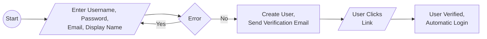
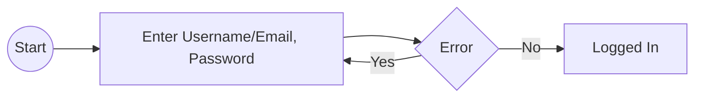
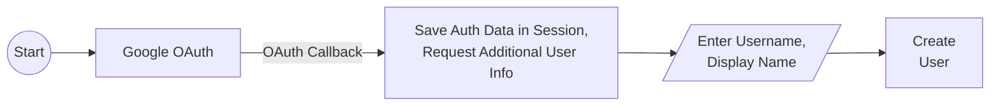
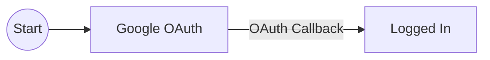
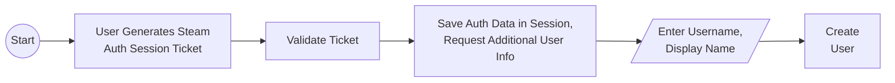
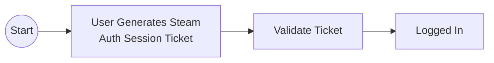

# Registration and Login Flow

## Basic

### Register

### Login

## Google

https://developers.google.com/identity/protocols/oauth2

### Register

### Login

## Steam

https://partner.steamgames.com/doc/features/auth

### Register

### Login

